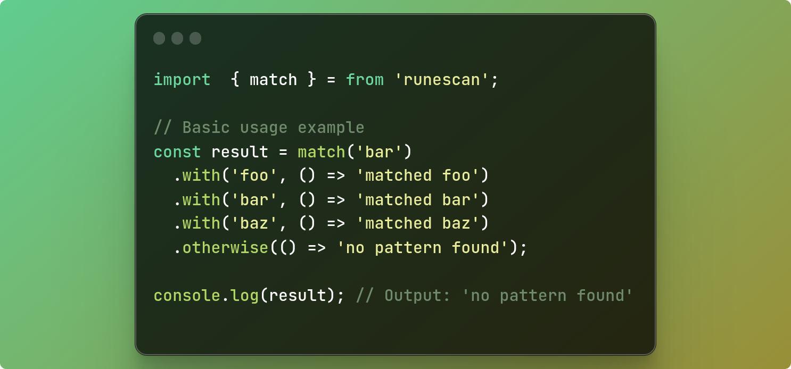

<div align="center">
   <h1>Runescan</h1>
   <strong>Runescan</strong> - Simplifying Pattern Recognition

   <br>
   
</div>
<br>
<div align="center">


</div>

### ✦ Introduction
The Runescan library aims to simplify conditional logic, allowing developers to avoid excessive **if-else** structures and make the code more readable and expressive.

### ✦ Documentation

The documentation is available in various versions and languages. Choose the version and language that suits you best:


- [Versão 1.0](docs/v1.0/README.md)
  - [Documentation in English](README.md)
  - [Documentation in Portuguese](docs/v1.0/REDME_pt_br.md)


### ✦ Installation

> Installing the library is straightforward.


```bash
npm i runescan
```
**Or use yarn if you prefer.**
```bash
yarn add runescan
``` 
<br>

### ✦ Main Methods

>Let's talk a bit about the main methods and what each one does.

<br>

`match():`

Method used to initialize a structure to perform checks on a value. It expects a value that can be of type string, number, bool.

```javascript
  // importing the library
  import {match} from "runescan";

  // using the match method
  match(value)
```
<br>

`with():`

The `with()` method is used to perform checks and execute actions based on the received value. It expects two arguments:
<br>

**expected:**

>The value with which you want to compare the initial value provided to the match() method. It can be a string, number, boolean, etc...

**callback:**

>A function to be executed if there is a match between the initial value and the expected value. This function can contain the desired logic to handle the match.

---

`outherWise():`

The outherWise method, as the name suggests, is a outherWise method that will be executed if there is no match. It expects only one argument.

**callback:**

>A function to be executed if there is no match between the initial value and the expected values


### ✦ Example of Use
Problem: Role-Based User Authentication

**Introduction:**

> Imagine a complex user authentication system, where different users have access to specific resources based on their roles. For example, a user can be an administrator, a moderator, or a standard user, each with different permissions.

**Solution using Runescan:**

```javascript

import { match } from "runescan";

// Example user and their role
const user = {  
   name: "John",  
   role: "admin", // Can be "admin", "moderator", or "user"
};

// Using Runescan to simplify conditional logic

const accessLevel = match(user.role)
.with("admin", () => "Full access granted")  
.with("moderator", () => "Moderate access granted")  
.with("user", () => "Limited access granted")  
.outherWise(() => "User role not recognized");

// Result
console.log(accessLevel);
```

### ✦ Contributions
We are open to contributions! Before you start, please read our [**contribution guidelines**](./CONTRIBUTING.md).
